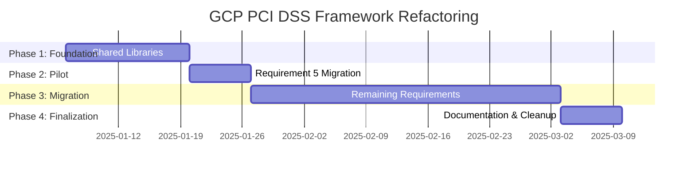

# Product Requirements Document: GCP PCI DSS Assessment Framework Refactoring

**Document Version:** 1.0  
**Date:** January 6, 2025  
**Author:** Technical Architecture Team  
**Status:** Draft for Review  

---

## Executive Summary

### Problem Statement
The current GCP PCI DSS assessment framework suffers from significant architectural debt with 40-60% code duplication across 9 requirement scripts (~8,100 total lines). This results in:
- Maintenance overhead requiring 9x effort for bug fixes
- Inconsistent user experience across requirements
- High risk of implementation drift
- Difficulty adding new PCI requirements or cloud services

### Proposed Solution
Refactor the monolithic script architecture into a modular, shared library framework that reduces codebase by 68% while improving maintainability, consistency, and extensibility.

### Business Impact
- **Development Efficiency**: 68% reduction in code maintenance
- **Quality Improvement**: Centralized testing and error handling
- **Time to Market**: Faster addition of new requirements
- **Risk Reduction**: Consistent compliance assessment across all requirements

---

## Product Overview

### Vision
Create a scalable, maintainable GCP PCI DSS assessment framework that serves as the gold standard for cloud compliance automation.

### Goals
1. **Eliminate Code Duplication**: Reduce from ~8,100 to ~2,600 lines
2. **Standardize User Experience**: Consistent interface across all requirements
3. **Improve Maintainability**: Single source of truth for common functionality
4. **Enable Scalability**: Plugin architecture for new requirements
5. **Enhance Quality**: Centralized testing and error handling

### Success Metrics
- **Code Reduction**: 68% decrease in total lines of code
- **Maintenance Efficiency**: 90% reduction in duplicate bug fixes
- **Development Speed**: 50% faster addition of new requirements
- **Quality Score**: 95% test coverage for shared libraries
- **User Satisfaction**: Consistent behavior across all assessment scripts

---

## Functional Requirements

### FR-1: Shared Library Framework

#### FR-1.1: Core Common Library (`gcp_common.sh`)
**Priority:** High  
**User Story:** As a developer, I want common utilities available across all scripts so that I don't duplicate basic functionality.

**Acceptance Criteria:**
- Provides standardized environment setup (colors, variables, directories)
- Implements unified command-line argument parsing
- Offers consistent status printing and logging functions
- Includes prerequisite validation (gcloud, permissions, connectivity)
- Supports configuration loading and validation

**Technical Specifications:**
```bash
# Required Functions
source_gcp_libraries()           # Load all required libraries
setup_environment()             # Initialize colors, variables, directories  
parse_common_arguments()        # Standard CLI parsing (-s, -p, -o, -h)
validate_prerequisites()        # Check gcloud, permissions, connectivity
print_status()                 # Colored output formatting
load_requirement_config()      # Load requirement-specific configuration
```

#### FR-1.2: HTML Report Engine (`gcp_html_report.sh`)
**Priority:** High  
**User Story:** As a compliance officer, I want consistent, professional HTML reports across all requirements.

**Acceptance Criteria:**
- Generates consistent HTML structure across all requirements
- Supports template-based report initialization
- Provides standardized section and check result formatting
- Includes dynamic summary and metrics generation
- Maintains responsive design for different screen sizes

**Technical Specifications:**
```bash
# Required Functions
initialize_report()            # Template-based report setup
add_section()                 # Dynamic section generation
add_check_result()            # Standardized check formatting
add_summary_metrics()         # Automated summary generation
finalize_report()             # Complete report and open if requested
```

#### FR-1.3: Permission Management Framework (`gcp_permissions.sh`)
**Priority:** High  
**User Story:** As a script user, I want consistent permission checking so I understand what access is required.

**Acceptance Criteria:**
- Supports declarative permission requirements per script
- Performs batch permission verification
- Calculates and reports permission coverage percentage
- Provides standardized user prompts for limited access
- Handles both project and organization scope permissions

**Technical Specifications:**
```bash
# Required Functions
register_required_permissions() # Define needed APIs per requirement
check_all_permissions()        # Batch permission verification
get_permission_coverage()      # Calculate percentage available
prompt_continue_limited()      # Standardized user interaction
validate_scope_permissions()   # Check scope-specific access
```

#### FR-1.4: Scope Management Engine (`gcp_scope_mgmt.sh`)
**Priority:** High  
**User Story:** As an assessor, I want to easily assess either single projects or entire organizations.

**Acceptance Criteria:**
- Supports both project and organization assessment scopes
- Provides unified project enumeration across scopes
- Generates scope-appropriate gcloud commands dynamically
- Handles cross-project data aggregation consistently
- Manages scope-specific reporting and output naming

**Technical Specifications:**
```bash
# Required Functions
setup_assessment_scope()       # Configure project/org scope based on args
get_projects_in_scope()       # Unified project enumeration
build_gcloud_command()        # Dynamic command construction with scope
run_across_projects()         # Execute commands across defined scope
aggregate_cross_project_data() # Combine results from multiple projects
```

### FR-2: Configuration-Driven Architecture

#### FR-2.1: Requirement Configuration Files
**Priority:** Medium  
**User Story:** As a developer, I want to configure requirements declaratively so I don't hardcode values in scripts.

**Acceptance Criteria:**
- Each requirement has a dedicated configuration file
- Configuration includes required permissions, assessment functions, and metadata
- Supports validation of configuration completeness
- Allows override of default behaviors per requirement
- Maintains backward compatibility during migration

**Technical Specifications:**
```bash
# Configuration File Structure (requirement_N.conf)
REQUIREMENT_NUMBER="N"
REQUIREMENT_TITLE="Requirement description"
REQUIRED_PERMISSIONS=("api1.resource.action" "api2.resource.action")
ASSESSMENT_FUNCTIONS=("check_function_1" "check_function_2")
CUSTOM_SCOPE_HANDLING="true|false"
INTERACTIVE_MODE="true|false"
```

#### FR-2.2: Template-Based Script Generation
**Priority:** Medium  
**User Story:** As a developer, I want a standard template for creating new requirement scripts.

**Acceptance Criteria:**
- Provides base template for new requirement scripts
- Reduces individual script size by 80%
- Maintains consistent execution flow across all scripts
- Supports requirement-specific customization points
- Includes comprehensive documentation and examples

### FR-3: Plugin Architecture for Assessments

#### FR-3.1: Modular Assessment Functions
**Priority:** Medium  
**User Story:** As a developer, I want to implement requirement-specific logic in isolated modules.

**Acceptance Criteria:**
- Each requirement has dedicated assessment module
- Modules follow standardized function signatures
- Support for requirement-specific data processing
- Integration with shared reporting framework
- Error handling consistent with shared libraries

**Technical Specifications:**
```bash
# Assessment Module Structure (assessments/requirement_N_checks.sh)
check_requirement_N_section_1() {
    local check_id="N.1.1"
    local title="Check description"
    local details=""
    local status="pass|fail|warning|info"
    
    # Requirement-specific logic
    
    add_check_result "$check_id" "$title" "$details" "$status"
}
```

---

## Non-Functional Requirements

### NFR-1: Performance
- **Response Time**: Individual script execution time should not increase by more than 10%
- **Resource Usage**: Memory usage should remain under 100MB per script
- **Scalability**: Support assessment of organizations with 1000+ projects

### NFR-2: Reliability
- **Error Handling**: 95% of error conditions should be handled gracefully
- **Data Integrity**: Assessment results must be consistent across runs
- **Fault Tolerance**: Scripts should continue with partial permissions

### NFR-3: Maintainability
- **Code Coverage**: 90% test coverage for all shared libraries
- **Documentation**: Comprehensive API documentation for all shared functions
- **Standards Compliance**: Follow established shell scripting best practices

### NFR-4: Usability
- **Backward Compatibility**: Existing command-line interfaces must remain unchanged
- **Error Messages**: Clear, actionable error messages for all failure scenarios
- **Progress Indicators**: Status updates for long-running assessments

### NFR-5: Security
- **Credential Handling**: No credentials stored in logs or temporary files
- **Audit Trail**: All assessments must be logged for audit purposes
- **Least Privilege**: Scripts should request minimum required permissions

---

## Technical Architecture

### Current State Architecture
```
9 Monolithic Scripts (900 lines each)
├── Duplicated HTML generation (200 lines × 9)
├── Duplicated utility functions (150 lines × 9)  
├── Duplicated scope management (100 lines × 9)
├── Duplicated permission checking (80 lines × 9)
└── Requirement-specific logic (370 lines × 9)

Total: ~8,100 lines with 60% duplication
```

### Target State Architecture
```
Shared Library Framework
├── lib/
│   ├── gcp_common.sh (200 lines)
│   ├── gcp_html_report.sh (300 lines)
│   ├── gcp_permissions.sh (150 lines)
│   └── gcp_scope_mgmt.sh (150 lines)
├── config/
│   └── requirement_N.conf (20 lines × 9)
├── assessments/
│   └── requirement_N_checks.sh (300 lines × 9)
└── Simplified Scripts (50 lines × 9)

Total: ~2,600 lines with <5% duplication
```

### Technology Stack
- **Shell Scripting**: Bash 4.0+ for compatibility
- **GCP CLI**: gcloud SDK for API interactions
- **JSON Processing**: jq for data parsing
- **HTML Generation**: Template-based with CSS frameworks
- **Testing**: bats-core for automated testing

---

## User Stories & Use Cases

### Epic 1: Framework Migration
**As a development team**, we want to migrate to the new architecture so that we can maintain the codebase more efficiently.

#### User Stories:
1. **US-1**: As a developer, I want shared libraries so I don't duplicate code
2. **US-2**: As a developer, I want configuration files so I can modify behavior without code changes
3. **US-3**: As a developer, I want templates so I can create new requirements quickly

### Epic 2: Improved User Experience
**As a compliance assessor**, we want consistent behavior across all requirements so that our assessment process is predictable.

#### User Stories:
1. **US-4**: As an assessor, I want consistent command-line interfaces across all scripts
2. **US-5**: As an assessor, I want consistent HTML reports with the same layout and styling
3. **US-6**: As an assessor, I want consistent error handling and user prompts

### Epic 3: Enhanced Maintenance
**As a maintenance team**, we want centralized functionality so that we can fix issues once instead of nine times.

#### User Stories:
1. **US-7**: As a maintainer, I want shared HTML generation so I fix styling issues once
2. **US-8**: As a maintainer, I want shared permission checking so I update API changes once
3. **US-9**: As a maintainer, I want shared utilities so I improve error handling once

---

## Implementation Plan

### Phase 1: Foundation (Sprint 1-2)
**Duration:** 2 weeks  
**Effort:** 40 hours

**Deliverables:**
- Create core shared libraries (gcp_common.sh, gcp_html_report.sh)
- Implement permission management framework
- Develop scope management engine
- Create automated testing framework

**Acceptance Criteria:**
- All shared libraries pass unit tests
- Documentation complete for all shared functions
- Integration testing framework operational

### Phase 2: Pilot Implementation (Sprint 3)
**Duration:** 1 week  
**Effort:** 20 hours

**Deliverables:**
- Refactor Requirement 5 (simplest) as pilot
- Create configuration file for Requirement 5
- Implement assessment module for Requirement 5
- Validate functionality and performance

**Acceptance Criteria:**
- Requirement 5 script uses shared libraries exclusively
- Output identical to original script
- Performance within 10% of original

### Phase 3: Gradual Migration (Sprint 4-8)
**Duration:** 5 weeks  
**Effort:** 100 hours

**Deliverables:**
- Migrate Requirements 1, 2, 4, 6, 7, 8, 9 (order by complexity)
- Create configuration files for all requirements
- Implement assessment modules for all requirements
- Comprehensive testing of all migrated scripts

**Acceptance Criteria:**
- All scripts use shared library framework
- Backward compatibility maintained
- All tests pass for migrated scripts

### Phase 4: Finalization (Sprint 9)
**Duration:** 1 week  
**Effort:** 20 hours

**Deliverables:**
- Create base template for new requirements
- Complete documentation and developer guidelines
- Remove deprecated duplicate code
- Performance optimization and final testing

**Acceptance Criteria:**
- Template available for new requirements
- Documentation complete and reviewed
- All deprecated code removed
- Performance benchmarks met

---

## Risk Assessment

### High Risk
**R-1: Breaking Changes During Migration**
- **Impact:** High - Could break existing workflows
- **Probability:** Medium
- **Mitigation:** Maintain backward compatibility, comprehensive testing, phased rollout

**R-2: Performance Degradation**
- **Impact:** Medium - Could slow assessment times
- **Probability:** Low
- **Mitigation:** Performance benchmarking, optimization, early testing

### Medium Risk
**R-3: Developer Adoption Resistance**
- **Impact:** Medium - Could slow development
- **Probability:** Medium  
- **Mitigation:** Training, documentation, gradual migration

**R-4: Scope Creep**
- **Impact:** Medium - Could delay delivery
- **Probability:** Medium
- **Mitigation:** Clear requirements, change control, regular reviews

### Low Risk
**R-5: GCP API Changes**
- **Impact:** Low - Isolated to specific functions
- **Probability:** High
- **Mitigation:** Centralized API handling, version monitoring

---

## Success Criteria & Acceptance

### Functional Acceptance
- [ ] All 9 requirement scripts successfully refactored
- [ ] Shared libraries provide all common functionality
- [ ] Configuration-driven behavior working correctly
- [ ] HTML reports maintain visual consistency
- [ ] Permission checking works across all scopes

### Performance Acceptance
- [ ] Script execution time within 10% of original
- [ ] Memory usage under 100MB per script
- [ ] Support for 1000+ project organizations

### Quality Acceptance
- [ ] 90% test coverage for shared libraries
- [ ] Zero critical security vulnerabilities
- [ ] Comprehensive documentation complete
- [ ] Code review approval from senior developers

### Business Acceptance
- [ ] 68% reduction in total lines of code achieved
- [ ] Development team trained on new architecture
- [ ] Stakeholder approval of user experience
- [ ] Migration completed within timeline and budget

---

## Appendices

### Appendix A: Current vs Proposed Code Metrics
| Metric | Current | Proposed | Improvement |
|--------|---------|----------|-------------|
| Total Lines | 8,100 | 2,600 | 68% reduction |
| Duplicated Lines | 4,860 | 130 | 97% reduction |
| Scripts | 9 × 900 lines | 9 × 50 lines | 94% reduction |
| Shared Code | 0 lines | 800 lines | New capability |
| Maintenance Points | 45 functions × 9 | 45 functions × 1 | 89% reduction |

### Appendix B: Risk Matrix
| Risk | Impact | Probability | Risk Level | Mitigation Strategy |
|------|--------|-------------|------------|-------------------|
| Breaking Changes | High | Medium | High | Backward compatibility + testing |
| Performance Issues | Medium | Low | Medium | Benchmarking + optimization |
| Adoption Resistance | Medium | Medium | Medium | Training + documentation |
| Scope Creep | Medium | Medium | Medium | Change control + reviews |
| API Changes | Low | High | Low | Centralized handling |

### Appendix C: Implementation Timeline


---

**Document Approval:**

| Role | Name | Signature | Date |
|------|------|-----------|------|
| Product Owner | [Name] | [Signature] | [Date] |
| Technical Lead | [Name] | [Signature] | [Date] |
| Security Lead | [Name] | [Signature] | [Date] |
| Development Manager | [Name] | [Signature] | [Date] |

---

*This document is version-controlled and maintained in the project repository. All changes require approval through the established change control process.*